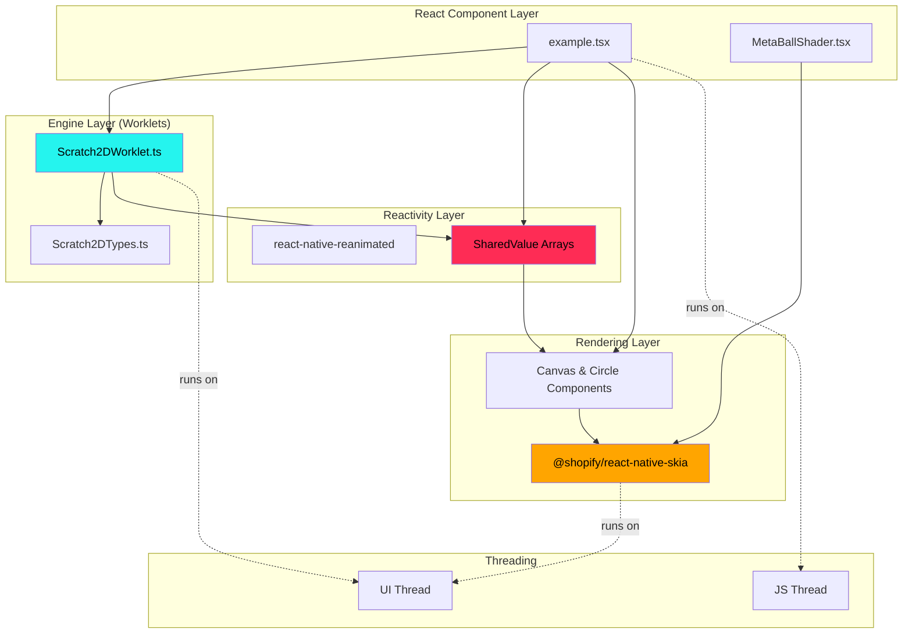
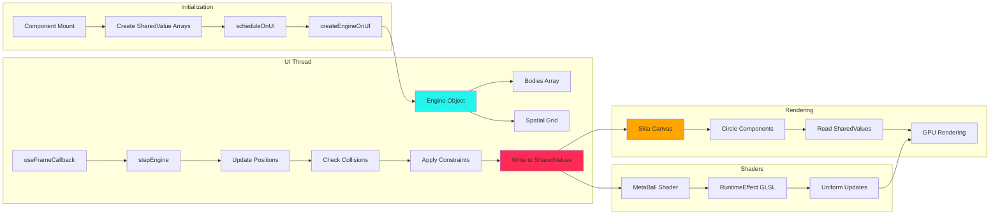
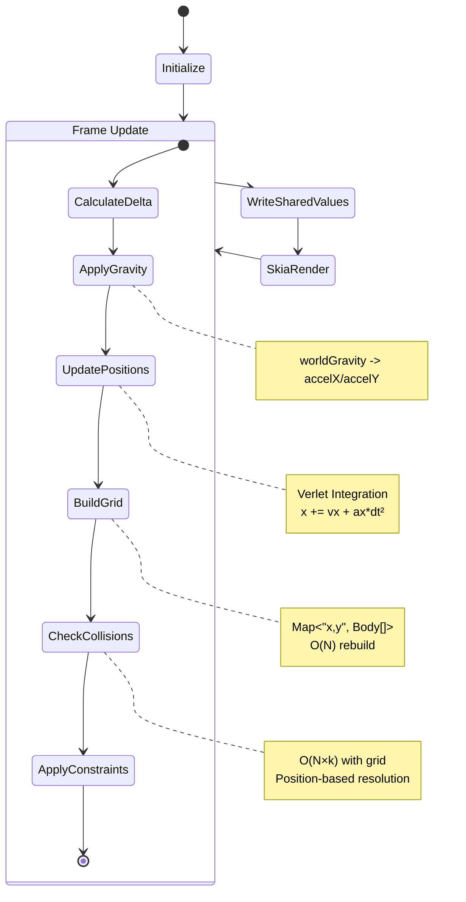
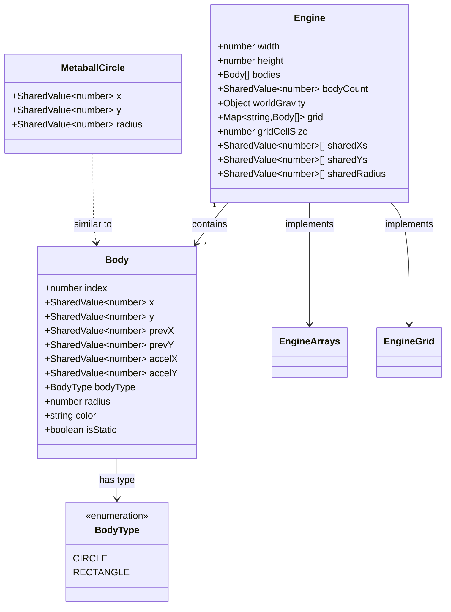
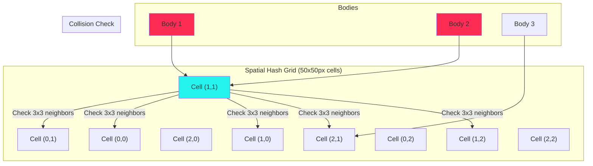
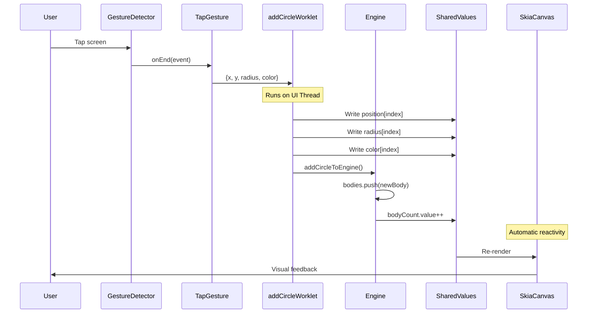
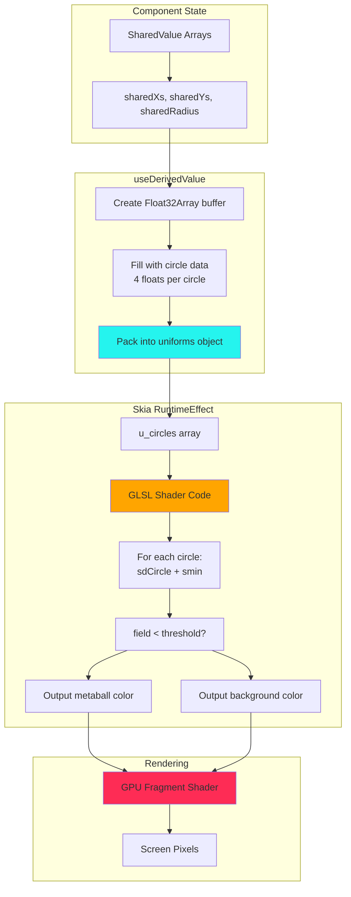

#Visualizations

## 🗺️ Architecture Overview

## 🗺️ Data Flow Architecture

## 🗺️ Physics Simulation Loop

## 🗺️ Type System Structure

## 🗺️ Spatial Grid Visualization

## 🗺️ Gesture Interaction Flow

## 🗺️ Shader Pipeline

